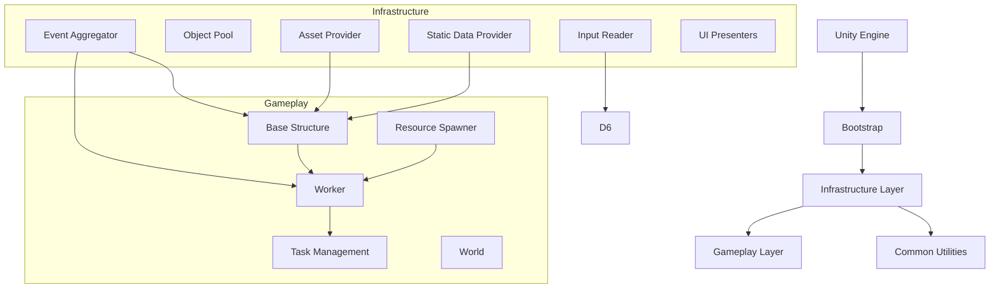

# Архитектура проекта

CollectorBots построен с использованием компонентно-ориентированной архитектуры Unity, дополненной слоистой структурой кода и рядом паттернов проектирования для повышения гибкости и поддерживаемости.

## Высокоуровневая диаграмма



## Используемые паттерны проектирования

### Observer (Наблюдатель)
Реализован через собственную систему событий `IntelligentEventAggregator`. Позволяет объектам подписываться на события без жёсткой связности.

**Пример:**
```csharp
// Подписка на событие
_eventAggregator.Subscribe<ResourceCollectedEvent>(OnResourceCollected);

// Публикация события
_eventAggregator.Publish(new ResourceCollectedEvent(resourceType, amount));
```

### Factory (Фабрика)
Используется для создания объектов через `IPrefabFactory` и его параметризованные варианты. `ObjectPool` реализует паттерн пула объектов для повторного использования префабов.

**Пример:**
```csharp
var worker = _workerFactory.Create(position, rotation);
```

### MVC (Model‑View‑Controller)
В UI применяется вариант MVP (Model‑View‑Presenter):
- **Model** — игровые данные (ресурсы, задачи).
- **View** — Unity UI компоненты (StorageView, ResourceManagementView).
- **Presenter** — посредник между Model и View, подписывается на события и обновляет UI.

### Component-Based (Компонентный)
Стандартный для Unity подход: каждый игровой объект состоит из компонентов (MonoBehaviour), которые добавляют функциональность.

### Service Locator (Локатор служб)
Доступ к `IEventAggregator` и другим сервисам осуществляется через статический класс `ServiceLocator` (или внедрение зависимостей через конструкторы).

## Структура папок проекта

```
Assets/
├── Scripts/                          # Все C# скрипты
│   ├── Common/                       # Общие утилиты и расширения
│   │   ├── Extensions/               # Методы расширения
│   │   │   ├── AreaExtensions.cs
│   │   │   ├── AssetProviderExtensions.cs
│   │   │   ├── CoroutineExtensions.cs
│   │   │   ├── DelegateExtensions.cs
│   │   │   ├── EnumerableExtensions.cs
│   │   │   ├── FactoryExtensions.cs
│   │   │   ├── RectangleExtensions.cs
│   │   │   └── TransformExtensions.cs
│   │   └── Utilities/                # Вспомогательные классы
│   │       ├── GizmosAreaDrawer.cs
│   │       ├── PriorityQueue.cs
│   │       ├── ThrowIf.cs
│   │       ├── Utils.cs
│   │       └── WeakReferenceComparer.cs
│   ├── Gameplay/                     # Игровая логика
│   │   ├── Common/                   # Общие игровые сущности
│   │   │   ├── Area.cs
│   │   │   ├── AreaRaycaster.cs
│   │   │   ├── Rectangle.cs
│   │   │   ├── ResourceSpendRequest.cs
│   │   │   └── Structure.cs
│   │   ├── Features/                 # Основные фичи
│   │   │   ├── BaseStructure/
│   │   │   ├── BuilderManagement/
│   │   │   ├── ResourceSpawner/
│   │   │   ├── TaskManagement/
│   │   │   ├── TransportationManagement/
│   │   │   ├── WorkerMovement/
│   │   │   ├── World/
│   │   │   ├── GrabPoint.cs
│   │   │   ├── Flag.cs
│   │   │   └── Worker.cs
│   │   └── StaticData/               ScriptableObject конфигурации
│   │       ├── BaseStructureConfig.cs
│   │       ├── BuilderConfig.cs
│   │       ├── ResourceSpawnerConfig.cs
│   │       └── ResourceWeight.cs
│   └── Infrastructure/               # Инфраструктурные сервисы
│       ├── Bootstrap.cs              # Точка входа
│       ├── Events/                   # Система событий
│       ├── Factories/                # Фабрики и пулы
│       ├── AssetManagement/          # Управление ресурсами
│       ├── Input/                    # Ввод пользователя
│       └── UI/                       # UI презентеры
├── Resources/                        # Ресурсы, загружаемые во время выполнения
│   ├── Prefabs/                      # Все префабы
│   ├── Configs/                      # ScriptableObject ассеты
│   ├── Animations/                   # Animation Controller и клипы
│   ├── Models/                       # 3D модели (.fbx)
│   ├── Materials/                    # Материалы
│   ├── Textures/                     # Текстуры
│   └── Fonts/                        # Шрифты TextMesh Pro
├── Scenes/                           # Единственная сцена
│   └── SampleScene.unity
└── Plugins/                          # Сторонние библиотеки (DOTween)
```

## Ключевые сцены

В проекте используется **одна сцена** — `SampleScene`. Она содержит:

- **World** — игровой мир с Terrain (Ground).
- **Bootstrap** — объект, инициализирующий все системы.
- **UI Canvas** — интерфейс пользователя.
- **NavMesh** — данные навигации для рабочих.

Сцена предварительно настроена с освещением, камерой и навигационной сеткой. Добавление новых сцен не требуется, так как весь геймплей происходит в рамках одной сцены.

## Основные Prefab-ы

### Infrastructure
- **Bootstrap.prefab** — точка входа, содержит `Bootstrap` компонент, который создаёт и регистрирует все сервисы.

### Universe
- **World.prefab** — контейнер для всего игрового мира, включает `World` компонент для управления глобальными объектами.

### Structures
- **Base.prefab** — главная база, имеет `BaseStructure` компонент, аниматор, зоны ожидания и доставки.
- **SecondaryBase.prefab** — вторичная база, аналогична главной, но с нулевым начальным количеством рабочих.
- **Flag.prefab** — флаг, который игрок может размещать для указания зоны сбора.

### Workers
- **Worker.prefab** — робот-рабочий, включает `Worker` компонент, аниматор, NavMeshAgent, скрипты движения и задач.

### Resource
- **IronResource.prefab**, **StoneResource.prefab**, **WoodResource.prefab** — ресурсы разных типов (маленькие).
- **MediumIronResource.prefab** и т.д. — ресурсы среднего размера (для разнообразия).

### Grounds
- **Ground.prefab** — террейн (земля), имеет коллайдер и навигационные данные.

### UI
- **ResourceManagementView.prefab** — панель управления задачами (готовые, назначенные, завершённые).
- **StorageView.prefab** — отображение количества ресурсов (камень, дерево, железо).
- **BaseStructurePanelGroup.prefab** — панель управления выбранной базой (постройка рабочих, установка флага).
- **Input.prefab** — объект с `InputReader` для обработки ввода.

## Взаимодействие слоёв

1. **Infrastructure Layer** предоставляет сервисы (события, пулы, ресурсы) через интерфейсы.
2. **Gameplay Layer** использует эти сервисы для реализации игровой логики.
3. **UI Layer** подписывается на события и отображает состояние игры.
4. **Common Utilities** используются всеми слоями для повторяющихся операций.

Такое разделение позволяет легко заменять реализации (например, перейти с Resources.Load на Addressables) и добавлять новые фичи без переписывания существующего кода.