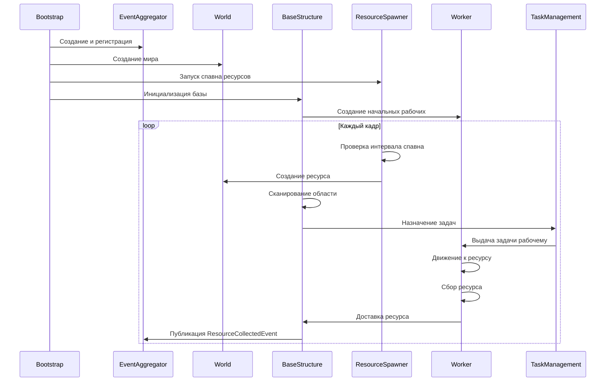

# Скрипты и код

В этом разделе описаны все C# скрипты проекта, их назначение и взаимосвязи.

## Полный список скриптов

### Common/Extensions
| Файл | Назначение |
|------|------------|
| `AreaExtensions.cs` | Расширения для работы с областью (`Area`): проверка пересечения, случайная точка внутри. |
| `AssetProviderExtensions.cs` | Упрощённые методы загрузки ресурсов через `IAssetProvider` (LoadPrefab, LoadConfig). |
| `CoroutineExtensions.cs` | Расширения для `MonoBehaviour` для запуска корутин с автоматической отменой при уничтожении объекта. |
| `DelegateExtensions.cs` | Утилиты для безопасного вызова делегатов (InvokeSafe). |
| `EnumerableExtensions.cs` | Методы для `IEnumerable<T>` (например, RandomElement). |
| `FactoryExtensions.cs` | Расширения для фабрик, создающие объекты с параметрами по умолчанию. |
| `RectangleExtensions.cs` | Операции с прямоугольниками (`Rectangle`): пересечение, объединение, случайная точка. |
| `TransformExtensions.cs` | Полезные методы для `Transform`: поиск детей по имени, сброс трансформации. |

### Common/Utilities
| Файл | Назначение |
|------|------------|
| `GizmosAreaDrawer.cs` | Визуализация областей (`Area`) в редакторе Unity через Gizmos. |
| `PriorityQueue.cs` | Обобщённая очередь с приоритетом на основе двоичной кучи. Используется для планирования задач. |
| `ThrowIf.cs` | Утилита для проверки предусловий с выбрасыванием исключений (ThrowIf.Null, ThrowIf.OutOfRange). |
| `Utils.cs` | Разнообразные статические helper‑методы (математика, преобразования, логика). |
| `WeakReferenceComparer.cs` | Компаратор для `WeakReference`, позволяющий использовать weak‑ссылки в коллекциях. |

### Gameplay/Common
| Файл | Назначение |
|------|------------|
| `Area.cs` | Представляет прямоугольную область на плоскости XZ с методами для проверки принадлежности точки. |
| `AreaRaycaster.cs` | Лучший в области для поиска объектов определённого типа (например, ресурсов). |
| `Rectangle.cs` | Структура прямоугольника с координатами левого нижнего и правого верхнего углов. |
| `ResourceSpendRequest.cs` | Запрос на трату ресурсов, содержит тип ресурса и количество. |
| `Structure.cs` | Базовый класс для всех строений (баз, флагов). Содержит общие свойства и методы. |

### Gameplay/Features
| Файл | Назначение |
|------|------------|
| `BaseStructure.cs` | Основной компонент базы: управление рабочими, сканирование ресурсов, постройка новых рабочих. |
| `BuilderManagement/` | Логика строительства (стоимость, время, отмена). |
| `ResourceSpawner.cs` | Система спавна ресурсов в заданной области с весами и интервалами. |
| `TaskManagement/` | Управление задачами рабочих (сбор, доставка, ожидание). |
| `TransportationManagement/` | Логика транспортировки ресурсов от точки сбора до базы. |
| `WorkerMovement/` | Движение рабочего по NavMesh с использованием `WorkerMover`. |
| `World.cs` | Контейнер для глобальных игровых объектов, обеспечивает доступ к земле, ресурсам, базам. |
| `GrabPoint.cs` | Точка захвата ресурса на рабочем (привязка ресурса к определённой кости). |
| `Flag.cs` | Компонент флага, который игрок может размещать для указания зоны сбора. |
| `Worker.cs` | Главный компонент рабочего: состояние, анимации, обработка задач, перемещение. |

### Gameplay/StaticData
| Файл | Назначение |
|------|------------|
| `BaseStructureConfig.cs` | ScriptableObject с настройками базы: радиус сканирования, интервалы, начальное количество рабочих. |
| `BuilderConfig.cs` | Конфигурация строительства: стоимость и время постройки базы и рабочего. |
| `ResourceSpawnerConfig.cs` | Настройки спавна ресурсов: веса типов, область спавна, интервал. |
| `ResourceWeight.cs` | Структура веса ресурса (тип и вес) для взвешенного случайного выбора. |
| `DataLoader.cs` | Загрузчик данных для конкретного типа ScriptableObject. |
| `DataLoaderGeneric.cs` | Обобщённый загрузчик данных. |
| `IStaticDataProvider.cs` | Интерфейс провайдера статических данных. |
| `StaticDataProvider.cs` | Реализация провайдера, загружающая конфиги из папки `Resources/Configs/`. |

### Infrastructure
| Файл | Назначение |
|------|------------|
| `Bootstrap.cs` | Точка входа: создаёт и регистрирует все сервисы (EventAggregator, AssetProvider, InputReader). |
| `ICoroutineRunner.cs` | Интерфейс для запуска корутин, абстрагирующий зависимость от MonoBehaviour. |
| `IInstantiator.cs` | Интерфейс для инстанцирования объектов (обычно через `Object.Instantiate`). |
| `ObjectInstantiator.cs` | Реализация `IInstantiator` с использованием Unity‑метода. |
| `SubscriptionInstaller.cs` | Вспомогательный класс для массовой подписки на события. |

### Infrastructure/Events
| Файл | Назначение |
|------|------------|
| `IntelligentEventAggregator.cs` | Основная реализация системы событий с поддержкой фильтров и условий подписки. |
| `MultipleSubscribeProvider.cs` | Провайдер для подписки на несколько событий одновременно. |
| `ObservableList.cs` | Реактивный список, уведомляющий об изменениях через события. |
| `SubscribeProvider.cs` | Базовый провайдер подписки на одно событие. |
| `FakeSource.cs` | Тестовый источник событий для отладки. |
| **Conditions/** | Условия подписки (AlwaysTrue, Named, Sequence, SourceProperty, SourceType). |
| **Contracts/** | Интерфейсы событийной системы (`IEvent`, `IEventAggregator`, `IEventFilter` и т.д.). |
| **Data/** | Вспомогательные классы (`EventTypeRegistry`, `SourceInfo`, `SubscriptionInfo`). |

### Infrastructure/Factories
| Файл | Назначение |
|------|------------|
| `ObjectPool.cs` | Пул объектов для повторного использования префабов. |
| `Factory.cs` | Базовая фабрика без параметров. |
| `SingleParameterFactory.cs` | Фабрика с одним параметром. |
| `TwoParametersFactory.cs` | Фабрика с двумя параметрами. |
| `ThreeParametersFactory.cs` | Фабрика с тремя параметрами. |
| **Contracts/** | Интерфейсы фабрик (`IFactory`, `ISingleParameterFactory` и т.д.). |
| **Data/** | События пула (`ObjectPoolEvent`, `PoolObjectCreatedEvent`). |

### Infrastructure/AssetManagement
| Файл | Назначение |
|------|------------|
| `IAssetProvider.cs` | Интерфейс для загрузки ресурсов (префабов, конфигов). |
| `AssetProvider.cs` | Реализация, использующая `Resources.Load` с кэшированием. |

### Infrastructure/Input
| Файл | Назначение |
|------|------------|
| `IInputReader.cs` | Интерфейс чтения ввода (клики, перемещение камеры). |
| `InputReader.cs` | Реализация на основе Unity Input System. |

### Infrastructure/UI
| Файл | Назначение |
|------|------------|
| **Contracts/** | `IPresenter` — базовый интерфейс презентера. |
| **Storage/** | `ResourceStoragePresenter`, `StorageView` — презентер и вид для отображения ресурсов. |
| **Structures/** | `BaseStructurePresenter`, `SelectedStructurePanelPresenter` — управление UI базы. |
| **TaskManagement/** | `ResourceTaskManagementPresenter` — презентер для задач сбора ресурсов. |

## Классификация по категориям

### Менеджеры (управляющие системы)
- `Bootstrap` — инициализация.
- `World` — управление игровым миром.
- `ResourceSpawner` — спавн ресурсов.
- `TaskManagement` — диспетчеризация задач.
- `BuilderManagement` — управление строительством.

### Модели данных
- `Area`, `Rectangle` — геометрические примитивы.
- `ResourceSpendRequest` — DTO для траты ресурсов.
- `ResourceWeight` — вес ресурса.
- `Structure` — абстракция строения.

### UI (Пользовательский интерфейс)
- Все презентеры в `Infrastructure/UI/`.
- `StorageView`, `ResourceManagementView` — Unity UI компоненты.

### Утилиты
- Все классы в `Common/Utilities` и `Common/Extensions`.
- `ThrowIf`, `PriorityQueue`, `Utils`.

### Сервисы
- `IntelligentEventAggregator` — система событий.
- `AssetProvider` — загрузка ресурсов.
- `StaticDataProvider` — доступ к конфигурациям.
- `InputReader` — обработка ввода.

## Жизненный цикл ключевых объектов



## Система обработки ввода

Ввод обрабатывается через **Unity Input System**. Класс `InputReader` реализует интерфейс `IInputReader` и предоставляет события:

- `OnClick` — при клике левой кнопкой мыши.
- `OnRightClick` — при клике правой кнопкой.
- `OnDrag` — при перемещении мыши с зажатой кнопкой.
- `OnZoom` — при прокрутке колёсика.

**Пример использования:**
```csharp
public class SomeController : MonoBehaviour
{
    [SerializeField] private IInputReader _inputReader;

    private void OnEnable()
    {
        _inputReader.OnClick += HandleClick;
    }

    private void OnDisable()
    {
        _inputReader.OnClick -= HandleClick;
    }

    private void HandleClick(Vector2 screenPosition)
    {
        // Конвертируем screenPosition в мировые координаты
        // и выполняем действие
    }
}
```

## Система событий

События реализованы через `IntelligentEventAggregator`, который поддерживает:

- **Типизированные события** (наследники `IEvent`).
- **Фильтры** (`IEventFilter`) для выборочной доставки.
- **Условия подписки** (`ISubscribeCondition`) для динамического управления подписками.
- **Weak‑ссылки** на подписчиков, чтобы избежать утечек памяти.

**Пример события:**
```csharp
public class ResourceCollectedEvent : IEvent
{
    public ResourceType Type { get; }
    public int Amount { get; }

    public ResourceCollectedEvent(ResourceType type, int amount)
    {
        Type = type;
        Amount = amount;
    }
}
```

**Подписка и публикация:**
```csharp
// Подписка
_eventAggregator.Subscribe<ResourceCollectedEvent>(OnResourceCollected);

// Публикация
_eventAggregator.Publish(new ResourceCollectedEvent(ResourceType.Stone, 1));

// Обработчик
private void OnResourceCollected(ResourceCollectedEvent evt)
{
    Debug.Log($"Собран ресурс {evt.Type} в количестве {evt.Amount}");
}
```

## Корутины и асинхронные операции

Для работы с корутинами используется интерфейс `ICoroutineRunner`, который позволяет запускать корутины вне MonoBehaviour.

**Пример:**
```csharp
public class SomeService
{
    private readonly ICoroutineRunner _coroutineRunner;

    public SomeService(ICoroutineRunner coroutineRunner)
    {
        _coroutineRunner = coroutineRunner;
    }

    public void StartCounting()
    {
        _coroutineRunner.StartCoroutine(CountCoroutine());
    }

    private IEnumerator CountCoroutine()
    {
        for (int i = 0; i < 10; i++)
        {
            Debug.Log(i);
            yield return new WaitForSeconds(1);
        }
    }
}
```

Расширение `CoroutineExtensions` добавляет метод `StartCoroutineSafe`, который автоматически останавливает корутину при уничтожении объекта.

## Рекомендации по добавлению нового кода

1. **Соблюдайте слоистую архитектуру**: инфраструктурный код — в `Infrastructure/`, игровая логика — в `Gameplay/`, общие утилиты — в `Common/`.
2. **Используйте события** для связи между системами, а не прямые вызовы.
3. **Проверяйте предусловия** с помощью `ThrowIf`.
4. **Документируйте публичные методы** XML‑комментариями.
5. **Следите за длиной файлов** — не более 200 строк (правило проекта).