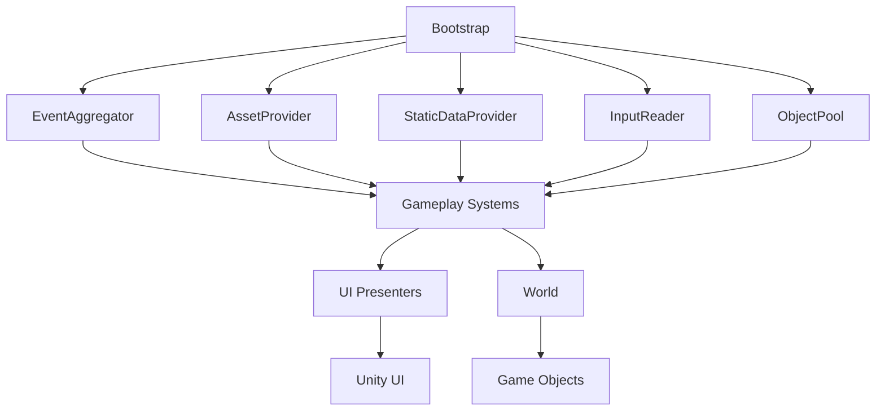

# Системы и сервисы

В этом разделе описаны инфраструктурные системы проекта, которые обеспечивают работу игровой логики. Эти системы реализованы как сервисы, доступные через интерфейсы, что позволяет легко заменять их реализации.

## Bootstrap — точка входа

`Bootstrap` — это MonoBehaviour, который создаётся на сцене из префаба `Infrastructure/Bootstrap.prefab`. Его задача — инициализировать все ключевые сервисы и передать управление игровому миру.

### Что делает Bootstrap:

1. **Создаёт экземпляры сервисов**:
   - `IntelligentEventAggregator` — система событий.
   - `AssetProvider` — загрузчик ресурсов.
   - `StaticDataProvider` — загрузчик конфигураций.
   - `InputReader` — обработчик ввода.
   - `ObjectPool` для рабочих и ресурсов (если требуется).
2. **Регистрирует сервисы** в статическом `ServiceLocator` (или передаёт их через конструкторы зависимостей).
3. **Создаёт мир** — инстанцирует префаб `World.prefab`.
4. **Запускает начальные процессы** — например, спавн ресурсов.

### Код инициализации (упрощённый):

```csharp
public class Bootstrap : MonoBehaviour
{
    private void Awake()
    {
        var eventAggregator = new IntelligentEventAggregator();
        var assetProvider = new AssetProvider();
        var staticDataProvider = new StaticDataProvider(assetProvider);
        var inputReader = Instantiate(inputPrefab).GetComponent<IInputReader>();

        ServiceLocator.Register(eventAggregator);
        ServiceLocator.Register(assetProvider);
        // ... и т.д.

        var world = assetProvider.LoadPrefab<World>("Prefabs/Universe/World");
        Instantiate(world);
    }
}
```

## IntelligentEventAggregator — система событий

Это собственная реализация паттерна «Наблюдатель» с расширенными возможностями.

### Основные возможности:

- **Типизированные события** — каждое событие реализует интерфейс `IEvent`.
- **Фильтрация** — можно подписаться только на события, удовлетворяющие условию (`IEventFilter`).
- **Условия подписки** (`ISubscribeCondition`) — например, подписка только на события от определённого источника.
- **Weak‑ссылки** — подписчики хранятся как `WeakReference`, что предотвращает утечки памяти при забытой отписке.
- **Множественная подписка** — через `MultipleSubscribeProvider` можно подписаться на несколько типов событий одной лямбдой.

### Пример использования:

```csharp
// Подписка с условием
_eventAggregator.Subscribe<ResourceCollectedEvent>(
    handler: evt => Debug.Log($"Ресурс {evt.Type} собран"),
    condition: SubscribeCondition.Builder()
        .SourceType<BaseStructure>()
        .Build()
);

// Публикация
_eventAggregator.Publish(new ResourceCollectedEvent(ResourceType.Stone, 1));
```

### Внутреннее устройство:

- `EventTypeRegistry` — регистрирует типы событий для быстрого поиска.
- `SubscriptionInfo` — хранит информацию о подписке (обработчик, условие, источник).
- `WeakReferenceComparer` — сравнивает weak‑ссылки для корректной работы коллекций.

## ObjectPool — пул объектов

Пул объектов используется для повторного использования префабов, чтобы избежать частого инстанцирования и уничтожения (например, для ресурсов и рабочих).

### Особенности:

- **Предварительное создание** — можно заранее создать N экземпляров.
- **Автоматическое расширение** — если в пуле нет свободных объектов, создаётся новый.
- **События пула** — `PoolObjectCreatedEvent`, `PoolObjectGettedEvent`, `PoolObjectReleasedEvent`.
- **Интерфейс `IObjectPool`** — позволяет абстрагироваться от конкретной реализации.

### Пример:

```csharp
var pool = new ObjectPool(workerPrefab, preloadCount: 5);
var worker = pool.Get(); // Взять объект из пула (или создать новый)
// ... использование
pool.Release(worker); // Вернуть в пул
```

## AssetProvider — управление ресурсами с кэшированием

`AssetProvider` реализует интерфейс `IAssetProvider` и отвечает за загрузку ресурсов (префабов, ScriptableObject, текстур) из папки `Resources`.

### Кэширование:

Загруженные ресурсы сохраняются в словаре, чтобы при повторном запросе не вызывать `Resources.Load`.

### Методы:

- `T LoadPrefab<T>(string path)` — загружает префаб по пути относительно `Resources`.
- `T LoadConfig<T>(string path)` — загружает ScriptableObject.
- `void Unload(string path)` — выгружает ресурс из кэша (если больше не нужен).

### Пример:

```csharp
var provider = new AssetProvider();
var workerPrefab = provider.LoadPrefab<GameObject>("Prefabs/Workers/Worker");
var config = provider.LoadConfig<BuilderConfig>("Configs/DefaultBuilderConfig");
```

## StaticDataProvider — статические данные

`StaticDataProvider` загружает все конфигурации (ScriptableObject) из папки `Resources/Configs/` и предоставляет к ним доступ через типизированные методы.

### Реализация:

Использует `AssetProvider` для загрузки, но также может кэшировать их в словаре по типу.

### Интерфейс:

```csharp
public interface IStaticDataProvider
{
    T GetConfig<T>() where T : ScriptableObject;
}
```

### Использование:

```csharp
var config = staticDataProvider.GetConfig<BuilderConfig>();
var cost = config.BaseCost; // например, стоимость постройки базы
```

## InputReader — ввод пользователя

`InputReader` — это обёртка над Unity Input System, которая преобразует низкоуровневые события ввода в удобные для игры события.

### Поддерживаемые действия:

- **Click** — левый клик мыши (выбор объекта, размещение флага).
- **RightClick** — правый клик (отмена, контекстное меню — не используется).
- **Drag** — перемещение мыши с зажатой левой кнопкой (перетаскивание камеры).
- **Zoom** — прокрутка колёсика (приближение/отдаление камеры).

### Реализация:

Использует `InputActionAsset` с предопределёнными action‑ами. События передаются через C# события (`event Action<Vector2> OnClick`).

### Пример подписки:

```csharp
_inputReader.OnClick += HandleClick;

private void HandleClick(Vector2 screenPosition)
{
    var ray = Camera.main.ScreenPointToRay(screenPosition);
    if (Physics.Raycast(ray, out var hit))
    {
        var structure = hit.collider.GetComponent<Structure>();
        if (structure != null)
            SelectStructure(structure);
    }
}
```

## Отсутствующие системы

### Система сохранения

**Не реализована.** В текущей версии нет сохранения прогресса (количества ресурсов, построенных баз, рабочих). Для добавления можно использовать:

- `PlayerPrefs` для простых данных.
- Сериализацию в JSON/XML для сложных структур.
- Unity `SaveSystem` (пакет `UnityEngine.Save`).

### Локализация

**Не реализована.** Все тексты в UI на английском (или русском, в зависимости от ассетов). Для поддержки нескольких языков можно интегрировать `I2 Localization` или `Unity Localization Package`.

### Аналитика и достижения

**Не реализованы.** Нет отслеживания статистики (сколько ресурсов собрано, сколько рабочих построено) и системы достижений. Можно добавить через Unity Analytics или сторонние SDK.

### Мультиплеер

**Не реализован.** Игра полностью однопользовательская. Добавление сетевого режима потребовало бы значительной переработки архитектуры (авторитетная серверная логика, синхронизация состояний).

## Взаимодействие систем



## Расширение систем

При необходимости добавить новую систему (например, систему звуков) рекомендуется:

1. Создать интерфейс (`IAudioService`) в папке `Infrastructure/`.
2. Реализовать его в отдельном классе (`AudioService`).
3. Зарегистрировать экземпляр в `Bootstrap` и передавать через зависимости (или использовать Service Locator).
4. Использовать события для интеграции с игровой логикой (например, публиковать `SoundPlayEvent` при сборе ресурса).